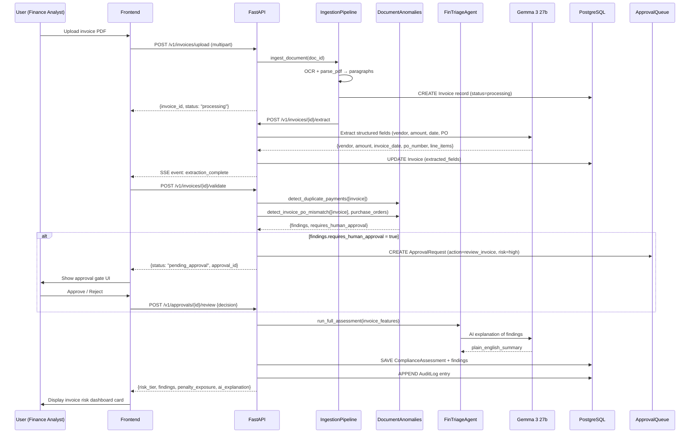
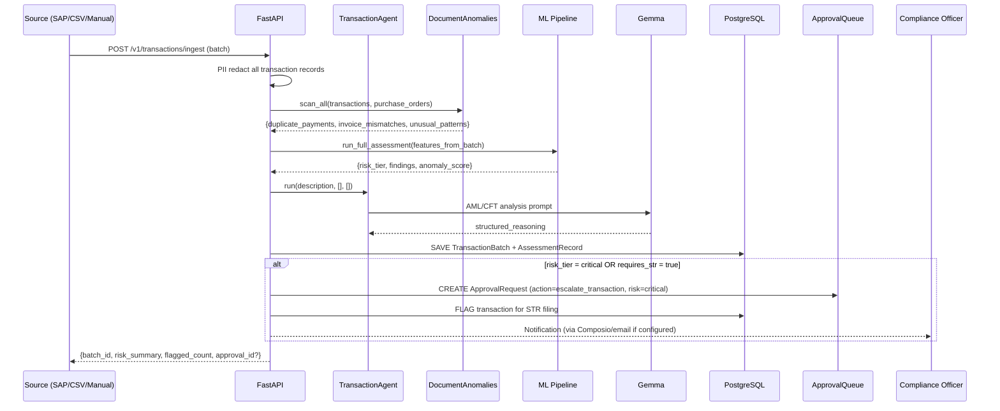
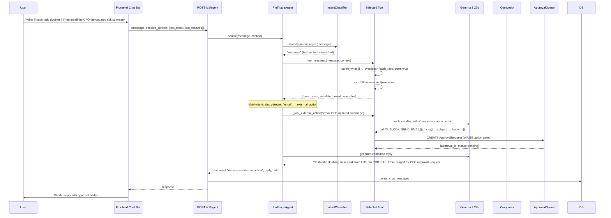
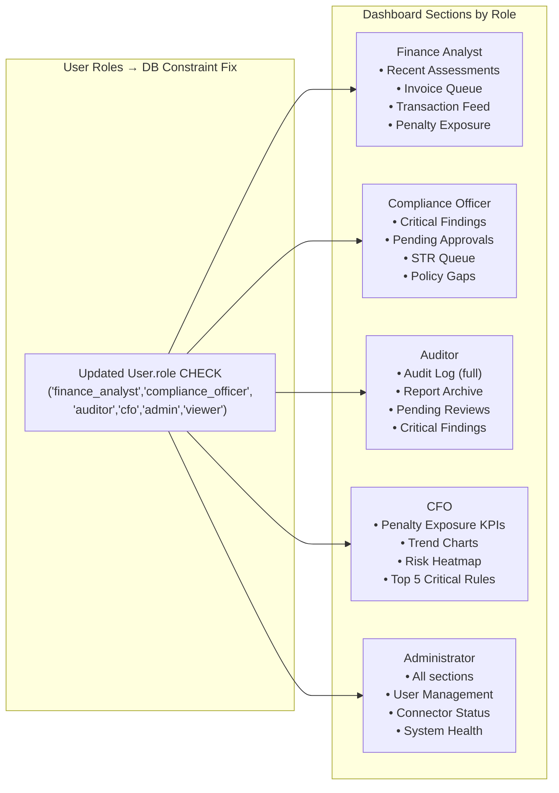

# Design Document: GemmaFin OS Platform

## Overview

GemmaFin OS is a production-grade FinOps and financial compliance platform built as a greenfield platform. It provides a full operating system for financial compliance — with audit-first workflows, real agentic behavior, deterministic ML pipelines wired to role-specific dashboards, and reliable MCP/Composio integrations.

The redesign retains every existing backend agent, ML model, connector, and database table while closing the gaps: broken wiring between components, incomplete business workflows, disconnected UI pages, non-functional Composio integrations, and the lack of end-to-end state management for approval-gated workflows.

---

## Phase 1 Audit — Current State Analysis

This section documents every broken, incomplete, or architecturally misaligned element found in the codebase audit.

### 1.1 Backend Problems

#### Orchestrator is only a chatbot, not an OS
`app/agents/orchestrator.py` implements 2 of the 7 required tools (`penalty_sim`, `explain_risk`) and rebuilds pipeline logic inline rather than calling `ml/pipeline.py`. It has been superseded by `FinTriageAgent` but is still imported nowhere actively — it is dead code producing confusion.

#### Two parallel, disconnected triage systems
- `POST /v1/compliance/triage` — runs multi-agent LLM reasoning (TransactionAgent, OnboardingAgent, etc.) and stores results in `compliance_triage_runs`
- `POST /v1/compliance/assess` — runs the 3-stage ML pipeline (Stage 0→1→2→3) and stores results in `compliance_assessments`

The frontend's `/compliance` page calls `/v1/compliance/assess` (the ML pipeline) but the dashboard page calls `/v1/dashboard` which only reads `compliance_assessments`. The LLM-agent triage at `/v1/compliance/triage` is never surfaced in the frontend at all — it exists but is unreachable from the UI.

#### FinTriageAgent `compare` tool requires `entities` in session context — never populated
`_tool_compare` requires `session_context['entities']` to be a dict of `{name: features}` but the frontend never populates this. The tool always returns the "I need at least 2 entities" error message. There is no UI for submitting entity pairs for comparison.

#### `extract_financial_features` uses regex-only extraction — no Gemma
`app/ml/risk_model_runner.py#extract_financial_features` uses regex patterns to pull metrics from free text. `app/api/v1/extract.py` adds keyword-based augmentation. Neither uses Gemma for structured extraction despite Plan.md Section 9 specifying Gemma multimodal extraction from PDFs/images. The `/api/extract` endpoint accepts text only — no file upload.

#### Invoice / document workflow is entirely manual
There is no `/v1/invoices` endpoint. The `POST /v1/compliance/scan-documents` endpoint in `connectors_api.py` accepts pre-formatted JSON. There is no file upload → OCR → normalize → scan pipeline exposed to the UI. `app/ingestion/pipeline.py` implements ingestion for legal documents (storage path from Supabase) — it is not wired to the FinOps compliance workflow at all.

#### Composio `get_openai_tools` uses session-based approach that may fail
`ComposioConnector.get_openai_tools()` calls `provider_client.tools.get(user_id=..., toolkits=...)` but the Composio SDK's OpenAI provider integration has changed APIs across versions. No fallback path if the `composio_openai` import fails. The `execute_composio_tool_gated` function correctly gates writes behind approvals, but the agent's `_tool_external_action` silently fails if Gemma's runtime doesn't support tool-calling (which it documents) with no retry path.

#### SAP connector has no invoice import workflow
`SAPODataConnector.fetch_supplier_invoices()` returns raw OData JSON. There is no mapping from SAP invoice fields to the `Transaction` dataclass used by `document_anomalies.scan_all()`. You cannot currently take SAP invoices and run them through the duplicate-payment or invoice-mismatch detectors without manual transformation.

#### `schema.sql` is the legal-product schema — FinOps tables are only in `models.py`
The SQL file defines `users`, `firms`, `matters`, `documents`, etc. for the legal product. The FinOps tables (`entities`, `compliance_assessments`, `compliance_findings`, `approval_requests`, etc.) exist in `models.py` as SQLAlchemy ORM models but there is no corresponding SQL migration file that matches the current model state. Alembic migrations are in `db/migrations/` but their completeness cannot be verified without running `alembic check`.

#### Role system mismatch
`models.py` `User.role` check constraint allows `('lawyer', 'admin', 'paralegal', 'client')` — legal product roles. `approvals.py` APPROVER_ROLES checks for `{'compliance_officer', 'cfo', 'auditor', 'admin'}` — FinOps roles. These never overlap (except `admin`), meaning no one except `admin` can approve actions through the approvals endpoint. `dashboard.py` ROLE_SECTIONS maps `finance_analyst`, `compliance_officer`, `auditor`, `cfo` — none of which can be set on a `User` record because the DB constraint rejects them.

#### Knowledge base is a stub
`app/ml/knowledge_base.py` — called by `FinTriageAgent._tool_platform_help` — is not visible in the file listing. Either it is empty or contains placeholder `answer_platform_question()` logic that returns hardcoded text.

#### `app/agents/risk_agent.py` is unused
`risk_agent.py` exists in the agents directory but is not referenced in `orchestrator.py`, `compliance.py`, or `fintriage_agent.py`. Likely superseded by `FinancialRiskAgent` but never deleted.

### 1.2 Frontend Problems

#### `/compliance` page runs ML pipeline, ignores LLM agents entirely
The compliance page calls `runAssessment` → `POST /v1/compliance/assess` which runs the 3-stage ML pipeline. The animated "Multi-Agent Pipeline Running" UI shows 5 agents running, but these are purely cosmetic — the actual ML pipeline has no per-agent events. The LLM-based agents (TransactionAgent, OnboardingAgent, etc.) never run from this page.

#### What-If panel is Phase: `whatif` code that is truncated in source
The compliance page has `{phase === 'whatif' && ...}` but the source file was truncated before this section. The what-if feature passes `features` directly to `runAssessment` correctly, but the UI for editing individual features is incomplete.

#### Dashboard uses `cream-50`, `brown-900`, `gold-500`, `olive-400` Tailwind tokens
The dashboard uses a custom design system (`font-body`, `font-display`, `font-calendas`, `text-cream-50`, `text-brown-900`, `text-gold-500`) from the landing page. These tokens are defined in `tailwind.config.ts` but the compliance pages use standard Tailwind zinc/blue/orange. The design systems are completely inconsistent across routes.

#### No invoice, vendor onboarding, or policy workflow pages
There are no frontend pages for:
- Invoice upload and processing (`/compliance/invoices`)
- Transaction monitoring (`/compliance/transactions`)  
- Vendor onboarding (`/compliance/vendors`)
- Policy document management (`/compliance/policies`)
- 5-step entity intake form (Plan.md Section 11 specifies `/assess` with a 5-step form)

#### Role-based dashboards not implemented
The dashboard fetches role from the API but there are no role-specific UI sections beyond showing/hiding panels. Finance Analyst, Auditor, Compliance Officer, CFO, and Administrator roles need distinct dashboard layouts per Plan.md.

#### Integrations page (`/integrations`) is a stub
`frontend/app/integrations/page.tsx` exists but likely shows connector status only (based on `GET /v1/connectors/status`). There is no OAuth flow UI for initiating Composio connections, no SAP configuration form, no Microsoft Graph setup wizard.

#### No audit log viewer
`ComplianceAuditLog` exists in `models.py` and `GET /v1/compliance/audit` returns pending audits, but there is no dedicated audit log page in the frontend beyond `AuditReviewPanel.tsx` component.

---

## Phase 2 Architecture

### 2.1 High-Level System Architecture

```mermaid
graph TD
    subgraph "Frontend — Next.js App Router"
        LandingPage["Landing Page /"]
        Dashboard["Role Dashboard /dashboard"]
        CompliancePage["Compliance Triage /compliance"]
        InvoicePage["Invoice Workflow /compliance/invoices"]
        TransactionPage["Transaction Monitor /compliance/transactions"]
        VendorPage["Vendor Onboarding /compliance/vendors"]
        PolicyPage["Policy Management /compliance/policies"]
        AssessPage["Entity Assessment /assess"]
        PenaltySim["Penalty Simulator /compliance/penalty-sim"]
        ReportPage["Report Viewer /compliance/report"]
        AuditPage["Audit Log /compliance/audit"]
        ApprovalsPage["Approvals Queue /approvals"]
        RulesPage["Rules Catalogue /compliance/rules"]
        IntegrationsPage["Integrations /integrations"]
        AgentChat["Agent Chat Bar — persistent"]
    end

    subgraph "Backend — FastAPI"
        subgraph "API Layer"
            TriageAPI["POST /v1/compliance/triage"]
            AssessAPI["POST /v1/compliance/assess"]
            InvoiceAPI["POST /v1/invoices"]
            TransactionAPI["POST /v1/transactions/ingest"]
            VendorAPI["POST /v1/vendors/onboard"]
            PolicyAPI["POST /v1/policies"]
            AgentAPI["POST /v1/agent"]
            ApprovalAPI["POST/GET /v1/approvals"]
            ConnectorAPI["GET /v1/connectors/*"]
            DashboardAPI["GET /v1/dashboard"]
            ReportAPI["POST /v1/compliance/report"]
            ExportAPI["GET /v1/exports/*"]
        end

        subgraph "Agent Layer"
            FinTriageAgent["FinTriageAgent — 9 tools"]
            TransactionAgent["TransactionAgent"]
            OnboardingAgent["OnboardingAgent"]
            RegulatoryAgent["RegulatoryAgent"]
            FinancialRiskAgent["FinancialRiskAgent"]
            ReportAgent["ReportAgent"]
            Orchestrator["WorkflowOrchestrator"]
        end

        subgraph "ML Pipeline"
            Stage0["Stage 0: AnomalyScorer"]
            Stage1["Stage 1: XGBoost Classifier"]
            Stage2["Stage 2: ComplianceGapScorer"]
            Stage3["Stage 3: CosineSimilarityRanker"]
            DocAnomalies["DocumentAnomalies: duplicate/mismatch/missing"]
        end

        subgraph "Connectors"
            ComposioConnector["Composio — Outlook/Slack/Sheets"]
            SAPConnector["SAP OData — Invoices/POs"]
            MSGraphConnector["Microsoft Graph — Outlook/Excel/SharePoint"]
            LocalDB["Local Database"]
        end

        subgraph "Core Services"
            GemmaClient["GemmaClient — Google AI Studio / Ollama"]
            PIIRedaction["PIIRedaction"]
            AuditLogger["AuditLogger"]
            ApprovalGate["ApprovalGate"]
            ExportService["ExportService — PDF/DOCX/JSON"]
            IngestionPipeline["IngestionPipeline — PDF/DOCX OCR"]
        end

        subgraph "Data Layer"
            PostgreSQL["PostgreSQL / Supabase"]
            Qdrant["Qdrant — Vector Store"]
            FileStorage["File Storage — Supabase Bucket"]
        end
    end

    Frontend --> API Layer
    API Layer --> Agent Layer
    API Layer --> ML Pipeline
    Agent Layer --> GemmaClient
    Agent Layer --> ML Pipeline
    Agent Layer --> Connectors
    Agent Layer --> ApprovalGate
    ApprovalGate --> PostgreSQL
    ML Pipeline --> GemmaClient
    API Layer --> Core Services
    Core Services --> PostgreSQL
    IngestionPipeline --> Qdrant
    IngestionPipeline --> FileStorage
```

### 2.2 End-to-End Workflow Sequence Diagrams

#### Invoice Processing Workflow



#### Transaction Monitoring Workflow



#### Agentic Multi-Step Workflow (Agent decides tools)



### 2.3 Role-Based Access and Dashboard Architecture



---

## Phase 3 — Components and Interfaces

### 3.1 New and Modified Backend Components

#### 3.1.1 Unified Workflow Router (`app/api/v1/workflows.py`) — NEW

The single entry point for all business document workflows. Replaces the dual `/triage` vs `/assess` confusion by routing to the right pipeline based on document type.

```python
class WorkflowType(str, Enum):
    INVOICE = "invoice"
    TRANSACTION_BATCH = "transaction_batch"
    VENDOR_ONBOARDING = "vendor_onboarding"
    POLICY_REVIEW = "policy_review"
    ENTITY_ASSESSMENT = "entity_assessment"
    FULL_TRIAGE = "full_triage"  # backward-compat with existing /triage

class WorkflowRequest(BaseModel):
    workflow_type: WorkflowType
    documents: List[UploadedDocument] = []
    structured_data: Optional[Dict[str, Any]] = None
    description: Optional[str] = None
    context: Optional[WorkflowContext] = None
    run_llm_agents: bool = True      # toggle for speed vs depth
    run_ml_pipeline: bool = True     # always true for risk scoring

class WorkflowContext(BaseModel):
    entity_id: Optional[str] = None
    business_name: Optional[str] = None
    sector: Optional[str] = None
    fiscal_year: Optional[str] = None
    currency: str = "INR"
    jurisdiction: str = "India"

class WorkflowResponse(BaseModel):
    workflow_id: str
    workflow_type: WorkflowType
    status: WorkflowStatus        # pending | running | completed | failed | awaiting_approval
    risk_tier: Optional[str] = None
    confidence: Optional[float] = None
    findings: List[ComplianceFinding] = []
    total_penalty_exposure_inr: float = 0.0
    requires_approval: bool = False
    approval_id: Optional[str] = None
    ai_explanation: Optional[str] = None
    audit_trail: List[AuditEntry] = []
    created_at: datetime
    completed_at: Optional[datetime] = None

@router.post("/workflows", response_model=WorkflowResponse)
async def run_workflow(req: WorkflowRequest, user=Depends(get_db_user), db: AsyncSession = Depends(get_db)) -> WorkflowResponse: ...

@router.get("/workflows/{workflow_id}", response_model=WorkflowResponse)
async def get_workflow(workflow_id: str, user=Depends(get_db_user), db: AsyncSession = Depends(get_db)) -> WorkflowResponse: ...

@router.get("/workflows", response_model=WorkflowListResponse)
async def list_workflows(workflow_type: Optional[WorkflowType] = None, limit: int = 50, user=Depends(get_db_user), db: AsyncSession = Depends(get_db)) -> WorkflowListResponse: ...
```

#### 3.1.2 Invoice API (`app/api/v1/invoices.py`) — NEW

```python
class InvoiceUploadResponse(BaseModel):
    invoice_id: str
    status: str            # "processing" | "extracted" | "validated" | "risk_scored"
    extracted_fields: Optional[InvoiceExtraction] = None
    validation_findings: List[Dict[str, Any]] = []
    risk_assessment: Optional[AssessResponse] = None
    requires_approval: bool = False
    approval_id: Optional[str] = None

class InvoiceExtraction(BaseModel):
    vendor_name: str
    vendor_gstin: Optional[str]
    invoice_number: str
    invoice_date: str
    amount_net: float
    amount_gst: float
    amount_total: float
    po_number: Optional[str]
    line_items: List[Dict[str, Any]]
    extraction_confidence: float     # 0.0-1.0, Gemma confidence
    raw_extracted_json: Dict[str, Any]

@router.post("/invoices/upload")
async def upload_invoice(file: UploadFile, po_number: Optional[str] = Form(None), user=Depends(get_db_user), db: AsyncSession = Depends(get_db)) -> InvoiceUploadResponse: ...
    # 1. Save file to storage
    # 2. Trigger ingestion pipeline (OCR if needed)
    # 3. Call Gemma for structured extraction
    # 4. Run duplicate_payment + invoice_po_mismatch detectors
    # 5. Run ML pipeline on extracted features
    # 6. Gate behind approval if critical findings
    # 7. Write audit log entry
    # 8. Return full response

@router.get("/invoices/{invoice_id}")
async def get_invoice(invoice_id: str, user=Depends(get_db_user), db: AsyncSession = Depends(get_db)) -> InvoiceUploadResponse: ...

@router.post("/invoices/batch")
async def upload_invoice_batch(files: List[UploadFile], user=Depends(get_db_user), db: AsyncSession = Depends(get_db)) -> List[InvoiceUploadResponse]: ...

@router.get("/invoices")
async def list_invoices(status: Optional[str] = None, risk_tier: Optional[str] = None, limit: int = 50, user=Depends(get_db_user), db: AsyncSession = Depends(get_db)) -> Dict[str, Any]: ...
```

#### 3.1.3 Transaction Ingestion API (`app/api/v1/transactions.py`) — NEW

```python
class TransactionIngestRequest(BaseModel):
    transactions: List[TransactionRecord]
    source: str = "manual"           # "sap" | "excel" | "outlook" | "manual" | "csv"
    import_purchase_orders: bool = False
    historical_avg_amount: Optional[float] = None
    historical_avg_monthly_count: Optional[float] = None

class TransactionRecord(BaseModel):
    external_id: str
    supplier: str
    amount: float
    transaction_date: str            # ISO date
    invoice_number: Optional[str] = None
    po_number: Optional[str] = None
    description: str = ""
    currency: str = "INR"
    account_code: Optional[str] = None

class TransactionIngestResponse(BaseModel):
    batch_id: str
    total_processed: int
    flagged_count: int
    duplicate_payments: List[Dict[str, Any]]
    invoice_mismatches: List[Dict[str, Any]]
    unusual_transactions: List[Dict[str, Any]]
    risk_assessment: AssessResponse
    requires_approval: bool
    approval_id: Optional[str] = None

@router.post("/transactions/ingest", response_model=TransactionIngestResponse)
async def ingest_transactions(req: TransactionIngestRequest, user=Depends(get_db_user), db: AsyncSession = Depends(get_db)) -> TransactionIngestResponse: ...

@router.post("/transactions/ingest/from-sap")
async def ingest_from_sap(top: int = 100, filter_expr: Optional[str] = None, user=Depends(get_db_user), db: AsyncSession = Depends(get_db)) -> TransactionIngestResponse: ...
    # Pulls from SAPODataConnector.fetch_supplier_invoices()
    # Maps SAP fields → TransactionRecord
    # Then calls ingest_transactions logic

@router.post("/transactions/ingest/from-excel")
async def ingest_from_excel(drive_item_path: str, worksheet: str = "Sheet1", user=Depends(get_db_user), db: AsyncSession = Depends(get_db)) -> TransactionIngestResponse: ...
```

#### 3.1.4 FinTriageAgent Extended to 9 Tools — MODIFY `app/agents/fintriage_agent.py`

Two new tools added; existing `compare` tool wired properly:

```python
TOOLS = [
    "reassess",           # what-if pipeline re-run
    "penalty_sim",        # regulatory fine calculation
    "threshold_sim",      # how far from rule breach
    "compare",            # side-by-side entity comparison (fixed: loads from DB)
    "explain_risk",       # plain-English risk driver explanation
    "rule_info",          # rule catalogue lookup
    "generate_report",    # 6-section audit report
    "external_action",    # Composio write actions (approval-gated)
    "platform_help",      # knowledge base RAG
]

# NEW: compare tool loads entity data from DB when session_context is missing
async def _tool_compare(self, message: str, ctx: Dict[str, Any]) -> Dict[str, Any]:
    entities: Dict[str, Dict[str, float]] = ctx.get("entities", {})
    
    if len(entities) < 2:
        # Attempt to load recent assessments from DB
        db_entities = await self._load_recent_entities(ctx.get("user_id"))
        if len(db_entities) >= 2:
            entities = db_entities
        else:
            return {
                "tool_used": "compare", "confidence": 0.3,
                "reply": "I need at least 2 entity profiles to compare. Run assessments for multiple entities first, or pass entity features in session_context['entities'].",
                "data": None,
            }
    # ... existing comparison logic
```

#### 3.1.5 Gemma Document Extraction Service — MODIFY `app/api/v1/extract.py`

Replace regex-only extraction with Gemma-first extraction and file upload support:

```python
@router.post("/compliance/extract")
async def extract_document(
    file: Optional[UploadFile] = File(None),
    text: Optional[str] = Form(None),
    document_type: str = Form("general"),
    user=Depends(current_user)
) -> ExtractResponse:
    # Preconditions:
    #   - At least one of file or text must be provided
    #   - file must be PDF, DOCX, PNG, JPG, or JPEG
    #   - document_type must be one of: general, bank_statement, gst_filing, onboarding, invoice
    # Postconditions:
    #   - Returns ExtractResponse with all 9 financial features populated
    #   - extraction_fields shows source (gemma|regex|default) and confidence per field
    #   - If Gemma unavailable, falls back to regex extraction
    ...
```

The Gemma extraction prompt template for invoice documents:

```python
GEMMA_INVOICE_PROMPT = """
You are a financial document parser. Extract the following fields from this invoice document.
Return ONLY valid JSON matching this schema exactly:

{
  "vendor_name": "string",
  "vendor_gstin": "string or null",
  "invoice_number": "string",
  "invoice_date": "YYYY-MM-DD",
  "amount_net": number,
  "amount_gst": number,
  "amount_total": number,
  "po_number": "string or null",
  "line_items": [{"description": "string", "quantity": number, "unit_price": number, "amount": number}],
  "monthly_txn_volume": number,
  "avg_ticket_size": number,
  "cash_ratio": float_0_to_1,
  "cross_border_ratio": float_0_to_1,
  "late_payment_rate": float_0_to_1,
  "business_age_years": number,
  "sector_risk_score": float_0_to_1,
  "director_count": number,
  "extraction_confidence": float_0_to_1
}

Document:
{document_text}
"""
```

#### 3.1.6 Database Role Constraint Migration — MODIFY `app/db/models.py` + new migration

The `User.role` check constraint must be updated to accept FinOps roles:

```python
# BEFORE — legal product roles only
CheckConstraint("role in ('lawyer', 'admin', 'paralegal', 'client')", name="users_role_chk")

# AFTER — unified role set covering both products
CheckConstraint(
    "role in ('lawyer', 'admin', 'paralegal', 'client', "
    "'finance_analyst', 'compliance_officer', 'auditor', 'cfo', 'viewer')",
    name="users_role_chk"
)
```

Alembic migration `add_finops_user_roles.py`:

```python
def upgrade() -> None:
    op.execute("ALTER TABLE users DROP CONSTRAINT users_role_chk")
    op.execute(
        "ALTER TABLE users ADD CONSTRAINT users_role_chk "
        "CHECK (role IN ('lawyer','admin','paralegal','client',"
        "'finance_analyst','compliance_officer','auditor','cfo','viewer'))"
    )

def downgrade() -> None:
    op.execute("ALTER TABLE users DROP CONSTRAINT users_role_chk")
    op.execute(
        "ALTER TABLE users ADD CONSTRAINT users_role_chk "
        "CHECK (role IN ('lawyer','admin','paralegal','client'))"
    )
```

#### 3.1.7 SAP → Transaction Mapper (`app/connectors/sap_mapper.py`) — NEW

```python
from app.ml.document_anomalies import Transaction
from datetime import datetime

SAP_INVOICE_FIELD_MAP = {
    # SAP OData field name → Transaction dataclass field
    "SupplierInvoice": "invoice_number",
    "DocumentDate": "transaction_date",
    "InvoiceGrossAmount": "amount",
    "Supplier": "supplier",
    "PurchaseOrder": "po_number",
    "SupplierInvoiceIDByInvcgParty": "external_id",
    "DocumentHeaderText": "description",
}

def map_sap_invoice_to_transaction(sap_invoice: Dict[str, Any]) -> Transaction:
    """
    Preconditions:
    - sap_invoice must contain at least SupplierInvoice, InvoiceGrossAmount
    Postconditions:
    - Returns Transaction with all required fields populated
    - Missing optional fields default to None or empty string
    - Amount always positive float in INR equivalent
    """
    return Transaction(
        id=sap_invoice.get("SupplierInvoice", str(uuid4())),
        supplier=sap_invoice.get("Supplier", "Unknown"),
        amount=float(sap_invoice.get("InvoiceGrossAmount", 0)),
        date=datetime.strptime(sap_invoice["DocumentDate"], "%Y-%m-%d") if sap_invoice.get("DocumentDate") else datetime.now(),
        invoice_number=sap_invoice.get("SupplierInvoiceIDByInvcgParty"),
        po_number=sap_invoice.get("PurchaseOrder"),
        description=sap_invoice.get("DocumentHeaderText", ""),
    )
```

---

## Phase 4 — Data Models

### 4.1 New Database Tables

```sql
-- Invoice processing workflow
CREATE TABLE invoices (
  id uuid PRIMARY KEY DEFAULT gen_random_uuid(),
  user_id uuid NOT NULL REFERENCES users(id) ON DELETE CASCADE,
  entity_id uuid REFERENCES entities(id) ON DELETE SET NULL,
  assessment_id uuid REFERENCES compliance_assessments(id) ON DELETE SET NULL,
  storage_path text,
  original_filename text NOT NULL,
  source text DEFAULT 'upload',  -- 'upload' | 'sap' | 'outlook' | 'sharepoint'
  status text DEFAULT 'uploaded' CHECK (status IN ('uploaded','processing','extracted','validated','risk_scored','approved','rejected')),
  extracted_fields jsonb DEFAULT '{}',
  validation_findings jsonb DEFAULT '[]',
  risk_tier text,
  duplicate_flags jsonb DEFAULT '[]',
  mismatch_flags jsonb DEFAULT '[]',
  requires_approval boolean DEFAULT false,
  approval_id uuid REFERENCES approval_requests(id) ON DELETE SET NULL,
  created_at timestamptz DEFAULT now(),
  updated_at timestamptz DEFAULT now()
);

-- Transaction batches
CREATE TABLE transaction_batches (
  id uuid PRIMARY KEY DEFAULT gen_random_uuid(),
  user_id uuid NOT NULL REFERENCES users(id) ON DELETE CASCADE,
  source text DEFAULT 'manual',  -- 'manual' | 'sap' | 'excel' | 'outlook' | 'csv'
  total_transactions int DEFAULT 0,
  flagged_count int DEFAULT 0,
  duplicate_findings jsonb DEFAULT '[]',
  mismatch_findings jsonb DEFAULT '[]',
  unusual_findings jsonb DEFAULT '[]',
  assessment_id uuid REFERENCES compliance_assessments(id),
  status text DEFAULT 'processed' CHECK (status IN ('processing','processed','escalated','resolved')),
  created_at timestamptz DEFAULT now()
);

-- Vendor onboarding cases
CREATE TABLE vendor_onboarding_cases (
  id uuid PRIMARY KEY DEFAULT gen_random_uuid(),
  user_id uuid NOT NULL REFERENCES users(id) ON DELETE CASCADE,
  entity_id uuid REFERENCES entities(id) ON DELETE SET NULL,
  vendor_name text NOT NULL,
  vendor_gstin text,
  vendor_pan text,
  sector text,
  provided_documents jsonb DEFAULT '[]',
  missing_documents jsonb DEFAULT '[]',
  kyc_status text DEFAULT 'pending' CHECK (kyc_status IN ('pending','in_review','approved','rejected','escalated')),
  risk_tier text,
  pep_flags jsonb DEFAULT '[]',
  ubo_issues jsonb DEFAULT '[]',
  assessment_id uuid REFERENCES compliance_assessments(id),
  approval_id uuid REFERENCES approval_requests(id),
  created_at timestamptz DEFAULT now(),
  updated_at timestamptz DEFAULT now()
);

-- Policy documents
CREATE TABLE policy_documents (
  id uuid PRIMARY KEY DEFAULT gen_random_uuid(),
  user_id uuid NOT NULL REFERENCES users(id) ON DELETE CASCADE,
  title text NOT NULL,
  policy_type text,  -- 'aml', 'kyc', 'vendor', 'expense', 'data_retention', 'other'
  storage_path text,
  version text DEFAULT '1.0',
  effective_date date,
  expiry_date date,
  status text DEFAULT 'active' CHECK (status IN ('draft','active','archived','expired')),
  indexed_chunks jsonb DEFAULT '[]',  -- Qdrant vector IDs for RAG
  compliance_gaps jsonb DEFAULT '[]',
  created_at timestamptz DEFAULT now()
);

-- Workflow runs (unified tracking across all workflow types)
CREATE TABLE workflow_runs (
  id uuid PRIMARY KEY DEFAULT gen_random_uuid(),
  user_id uuid NOT NULL REFERENCES users(id) ON DELETE CASCADE,
  workflow_type text NOT NULL CHECK (workflow_type IN ('invoice','transaction_batch','vendor_onboarding','policy_review','entity_assessment','full_triage')),
  status text NOT NULL DEFAULT 'pending' CHECK (status IN ('pending','running','completed','failed','awaiting_approval')),
  source_id text,     -- invoice_id, batch_id, case_id, or assessment_id depending on type
  risk_tier text,
  confidence float,
  total_penalty_exposure_inr float DEFAULT 0,
  requires_approval boolean DEFAULT false,
  approval_id uuid REFERENCES approval_requests(id),
  ai_explanation text,
  error_message text,
  created_at timestamptz DEFAULT now(),
  completed_at timestamptz
);

-- Audit trail entries (per-action, per-workflow)
CREATE TABLE audit_trail_entries (
  id uuid PRIMARY KEY DEFAULT gen_random_uuid(),
  workflow_run_id uuid REFERENCES workflow_runs(id) ON DELETE CASCADE,
  user_id uuid REFERENCES users(id) ON DELETE SET NULL,
  action text NOT NULL,  -- 'document_uploaded', 'extraction_complete', 'risk_scored', 'approval_requested', 'approved', 'rejected', 'report_generated', 'exported'
  actor text DEFAULT 'system',  -- 'system' | 'gemma' | user email/name
  details jsonb DEFAULT '{}',
  created_at timestamptz DEFAULT now()
);
```

---

## Phase 5 — Algorithmic Pseudocode (Low-Level Design)

### 5.1 Core ML Pipeline (`app/ml/pipeline.py`) — Full Algorithm

```pascal
ALGORITHM run_full_assessment(features, detected_flags, sector, risk_tier) -> AssessmentResult
INPUT: features: Dict[str, float] — 9D feature vector
       detected_flags: List[str] — Stage-0 flag names (optional, auto-detected if empty)
       sector: str — entity sector (optional)
       risk_tier: str — pre-computed tier (optional, for override scenarios)
OUTPUT: AssessmentResult with {risk_tier, confidence, findings, penalty_exposure, imprisonment_risk}

PRECONDITIONS:
  - features is non-null with at least 'anomaly_risk_score' key
  - All feature values are in valid ranges (see Stage 1 feature table)

POSTCONDITIONS:
  - risk_tier is one of: 'low', 'medium', 'high', 'critical'
  - confidence is in [0.0, 1.0]
  - findings is sorted by combined_score descending
  - total_penalty_exposure_inr is sum of max_penalty_inr for all critical/hard-gate findings

BEGIN
  // Stage 0: Anomaly Scoring
  IF detected_flags IS empty THEN
    detected_flags ← detect_flags_from_text(features_text_representation)
  END IF
  
  anomaly_result ← score_anomalies(detected_flags, llm_generate=_llm_generate_fn())
  features["anomaly_risk_score"] ← anomaly_result.normalized_for_xgboost
  
  // Hard escalation gate: PEP or shell company → always Critical
  auto_escalated ← false
  IF any flag IN detected_flags CONTAINS ("pep", "shell_company", "director_pep_match") THEN
    risk_tier ← "critical"
    auto_escalated ← true
  END IF
  
  // Stage 1: XGBoost Classification (skip if auto-escalated)
  IF NOT auto_escalated THEN
    xgb_result ← predict_risk_tier(features)
    risk_tier ← xgb_result.tier
    confidence ← xgb_result.confidence
    model_fallback ← xgb_result.fallback
  ELSE
    confidence ← 0.95
    model_fallback ← false
  END IF
  
  // Stage 2+3: Compliance Gap Scoring + Cosine Similarity
  findings ← score_compliance_gaps(
    features,
    risk_tier=risk_tier,
    sector=sector,
    top_n=5
  )
  
  // Compute penalty exposure: sum max penalties for hard-gate findings
  total_penalty ← 0
  imprisonment_risk ← false
  FOR each finding IN findings DO
    IF finding.hard_gate OR finding.severity IN ("critical", "high") THEN
      total_penalty ← total_penalty + finding.max_penalty_inr
    END IF
    IF finding.imprisonment_risk THEN
      imprisonment_risk ← true
    END IF
  END FOR
  
  RETURN AssessmentResult(
    risk_tier=risk_tier,
    confidence=confidence,
    model_fallback=model_fallback,
    auto_escalated=auto_escalated,
    detected_flags=detected_flags,
    anomaly=anomaly_result,
    findings=findings,
    features=features,
    total_penalty_exposure_inr=total_penalty,
    imprisonment_risk=imprisonment_risk
  )
END
```

### 5.2 Invoice Processing Pipeline Algorithm

```pascal
ALGORITHM process_invoice(file_bytes, filename, po_number, user_id, db) -> InvoiceUploadResponse
INPUT: file_bytes: bytes — raw PDF or image bytes
       filename: str — original filename
       po_number: str — optional PO reference
       user_id: str — authenticated user
       db: AsyncSession — database session
OUTPUT: InvoiceUploadResponse with extraction, validation, risk assessment

PRECONDITIONS:
  - file_bytes is non-empty
  - filename ends with .pdf, .png, .jpg, or .jpeg
  - user_id is a valid authenticated user ID

POSTCONDITIONS:
  - Invoice record created in DB with status tracking
  - If duplicate or mismatch found: requires_approval = true, approval_id set
  - audit_trail contains entry for every state transition
  - PII redacted before any LLM call

BEGIN
  // 1. Store file
  storage_path ← upload_to_storage(file_bytes, user_id, filename)
  invoice ← CREATE Invoice(storage_path, filename, status="uploaded")
  APPEND audit_entry("document_uploaded", invoice.id)
  
  // 2. OCR if image
  IF filename ENDS WITH (.png, .jpg, .jpeg) THEN
    text ← ocr_pdf_pages(file_bytes)[0]
  ELSE
    text ← extract_text_from_pdf(file_bytes)
  END IF
  
  // 3. PII redaction
  clean_text ← redact_user_input(text, user_id).redacted_text
  
  // 4. Gemma extraction
  client ← get_llm_client_or_none()
  IF client IS NOT NULL THEN
    prompt ← GEMMA_INVOICE_PROMPT.format(document_text=clean_text)
    resp ← client.chat.completions.create(
      model=get_llm_model(),
      messages=[{role: "user", content: prompt}],
      temperature=0.0,
      response_format={"type": "json_object"}
    )
    extraction ← parse_json(resp.choices[0].message.content)
  ELSE
    extraction ← regex_extract_invoice_fields(clean_text)  // fallback
  END IF
  
  invoice.extracted_fields ← extraction
  invoice.status ← "extracted"
  APPEND audit_entry("extraction_complete", invoice.id, {confidence: extraction.extraction_confidence})
  
  // 5. Duplicate & mismatch detection
  txn ← map_extraction_to_transaction(extraction)
  existing_txns ← fetch_recent_transactions(user_id, supplier=extraction.vendor_name, days=30)
  
  dup_findings ← detect_duplicate_payments([txn] + existing_txns)
  
  pos ← []
  IF po_number IS NOT NULL THEN
    pos ← fetch_purchase_orders(po_number)
  END IF
  mismatch_findings ← detect_invoice_po_mismatch([txn], pos)
  
  all_findings ← dup_findings + mismatch_findings
  requires_approval ← any(f.severity == "critical" FOR f IN all_findings)
  
  // 6. Risk assessment via ML pipeline
  features ← extract_financial_features(clean_text)
  ml_result ← run_full_assessment(features)
  
  invoice.risk_tier ← ml_result.risk_tier
  invoice.duplicate_flags ← dup_findings
  invoice.mismatch_flags ← mismatch_findings
  invoice.status ← "risk_scored"
  
  // 7. Approval gate for critical findings
  approval_id ← null
  IF requires_approval OR ml_result.risk_tier == "critical" THEN
    approval ← CREATE ApprovalRequest(
      action_type="review_invoice",
      risk_level="critical" IF ml_result.risk_tier == "critical" ELSE "high",
      payload={invoice_id: invoice.id, findings: all_findings}
    )
    approval_id ← approval.id
    invoice.approval_id ← approval_id
    invoice.requires_approval ← true
    APPEND audit_entry("approval_requested", invoice.id, {approval_id})
  END IF
  
  // 8. Commit and return
  COMMIT db
  
  RETURN InvoiceUploadResponse(
    invoice_id=invoice.id,
    status=invoice.status,
    extracted_fields=extraction,
    validation_findings=all_findings,
    risk_assessment=ml_result,
    requires_approval=requires_approval,
    approval_id=approval_id
  )
END
```

### 5.3 Agentic Multi-Step Intent Chaining Algorithm

The current `FinTriageAgent.handle()` dispatches to exactly one tool per call. The redesign supports chaining when the user message contains multiple distinct intents.

```pascal
ALGORITHM handle_multi_intent(message, session_context) -> AgentResponse
INPUT: message: str — user message
       session_context: Dict — current assessment context
OUTPUT: AgentResponse with combined reply, all tool outputs

PRECONDITIONS:
  - message is non-empty string
  - session_context may be empty (first call)

POSTCONDITIONS:
  - tool_used contains all executed tool names joined by "+"
  - If any tool returns pending_approval, reply includes the approval ID
  - All tool results persisted to chat history

BEGIN
  // Step 1: Extract all intents (regex first, then Gemma for remainder)
  intents ← []
  remaining_message ← message
  
  FOR each (intent, pattern) IN _INTENT_PATTERNS DO
    match ← pattern.search(remaining_message)
    IF match IS NOT NULL THEN
      intents.APPEND(intent)
      // Do NOT remove from remaining — patterns can overlap
    END IF
  END FOR
  
  // Remove duplicates while preserving order
  intents ← deduplicate_preserving_order(intents)
  
  // Gemma fallback for undetected complex intents
  IF intents IS empty THEN
    intents ← [classify_intent_llm(message)]
  END IF
  
  // Step 2: Execute tools sequentially (order matters: reassess before report)
  SORT intents BY _TOOL_EXECUTION_ORDER  // reassess → penalty_sim → explain_risk → generate_report → external_action
  
  tool_results ← []
  accumulated_context ← COPY session_context
  
  FOR each intent IN intents DO
    handler ← get_handler(intent)
    IF handler IS NULL THEN CONTINUE
    
    result ← handler(message, accumulated_context)
    tool_results.APPEND(result)
    
    // Feed outputs of earlier tools into context for later tools
    IF intent == "reassess" AND result.data IS NOT NULL THEN
      accumulated_context["last_result"] ← result.data.simulated
      accumulated_context["last_features"] ← result.data.simulated.features
    END IF
  END FOR
  
  // Step 3: Synthesize combined reply
  IF len(tool_results) == 1 THEN
    final_reply ← tool_results[0].reply
  ELSE
    // Gemma combines multiple tool outputs into coherent response
    combined_context ← join(result.reply FOR result IN tool_results, separator="\n\n---\n\n")
    final_reply ← generate_combined_reply(combined_context, message)
  END IF
  
  RETURN AgentResponse(
    tool_used=join(result.tool_used FOR result IN tool_results, "+"),
    confidence=min(result.confidence FOR result IN tool_results),
    reply=final_reply,
    data={result.tool_used: result.data FOR result IN tool_results}
  )
END
```

### 5.4 Role-Based Dashboard Data Assembly Algorithm

```pascal
ALGORITHM get_dashboard_data(user_id, user_role, db) -> DashboardPayload
INPUT: user_id: str — authenticated user
       user_role: str — one of finance_analyst|compliance_officer|auditor|cfo|admin
       db: AsyncSession
OUTPUT: DashboardPayload — role-filtered sections

PRECONDITIONS:
  - user_id is valid authenticated user
  - user_role is one of the valid FinOps roles

POSTCONDITIONS:
  - Only sections defined in ROLE_SECTIONS[user_role] are populated
  - Penalty exposure figures are always aggregated (never raw PII)
  - All queries are filtered by user's organization_id (tenant scoping)

BEGIN
  sections ← ROLE_SECTIONS[user_role]
  payload ← {role: user_role, sections_visible: sections}
  
  // Always fetched (cheap count queries)
  assessments ← list_assessments_for_user(db, user_id, limit=20)
  total_exposure ← SUM(a.total_penalty_exposure_inr FOR a IN assessments)
  critical_count ← COUNT(a FOR a IN assessments WHERE a.risk_tier == "critical")
  
  IF "recent_assessments" IN sections THEN
    payload["recent_assessments"] ← format_assessment_list(assessments[:10])
  END IF
  
  IF "penalty_exposure_summary" IN sections THEN
    payload["penalty_exposure_summary"] ← {
      total: total_exposure,
      count: len(assessments),
      critical_count: critical_count,
      trend_7d: compute_7day_trend(db, user_id),
      by_framework: breakdown_by_framework(assessments)
    }
  END IF
  
  IF "critical_findings" IN sections THEN
    payload["critical_findings"] ← [
      format_finding(f)
      FOR f IN fetch_critical_findings(db, user_id, limit=10)
    ]
  END IF
  
  IF "pending_approvals" IN sections THEN
    // Compliance officers and auditors see all org approvals
    // Finance analysts see only their own
    scope ← "org" IF user_role IN ("compliance_officer", "auditor", "cfo", "admin") ELSE "user"
    payload["pending_approvals"] ← fetch_pending_approvals(db, user_id, scope)
  END IF
  
  IF "invoice_queue" IN sections THEN
    payload["invoice_queue"] ← fetch_recent_invoices(db, user_id, status="validated", limit=10)
  END IF
  
  IF "transaction_feed" IN sections THEN
    payload["transaction_feed"] ← fetch_recent_transactions(db, user_id, limit=20)
  END IF
  
  IF "str_queue" IN sections THEN
    payload["str_queue"] ← fetch_str_flagged_runs(db, user_id, limit=10)
  END IF
  
  IF "audit_reports" IN sections THEN
    payload["audit_reports"] ← fetch_audit_reports(db, user_id, limit=10)
  END IF
  
  RETURN payload
END
```

---

## Phase 6 — Frontend Architecture

### 6.1 New Page Structure

```
/                          → Landing page (existing, kept)
/dashboard                 → Role-aware unified dashboard (redesigned)
/assess                    → 5-step entity intake form (new)
/compliance                → ML Pipeline assessment (existing, enhanced)
/compliance/invoices        → Invoice management queue (new)
/compliance/invoices/[id]   → Individual invoice detail (new)
/compliance/transactions    → Transaction monitoring feed (new)
/compliance/vendors         → Vendor onboarding cases (new)
/compliance/policies        → Policy document library (new)
/compliance/rules           → Compliance rules catalogue (existing)
/compliance/rules/[code]    → Rule detail page (new)
/compliance/penalty-sim     → Penalty simulator (existing, enhanced)
/compliance/report          → Report viewer (existing, enhanced)
/compliance/history         → Legacy triage history (existing)
/compliance/assessments     → ML pipeline assessment history (existing)
/compliance/audit           → Audit log viewer (new)
/approvals                  → Approvals queue (existing, enhanced)
/integrations               → Connector setup + status (redesigned)
/agent                      → Standalone agent chat (existing, enhanced)
```

### 6.2 Design System Unification

The landing page uses a custom warm-toned design system (`cream-50`, `brown-900`, `gold-500`) while compliance pages use Tailwind zinc/blue/orange. All FinOps application pages will adopt the landing page design system for visual consistency.

```typescript
// tailwind.config.ts — existing custom tokens (already defined, must be used consistently)
// cream: { 50: '#faf8f5', ... }
// brown: { 500: '#8B7355', 700: '#6B5943', 900: '#3d2b1f' }
// gold: { 500: '#C9922A' }
// olive: { 400: '#7C8C5A' }
// error: { 500: '#E53E3E' }
// font-body: 'Inter' or similar sans-serif
// font-display: 'Playfair Display' or similar serif
// font-calendas: 'Calendas Plus' — decorative

// Shared component tokens for FinOps pages
const RISK_THEME = {
  critical: { bg: 'bg-error-500',     text: 'text-cream-50',    badge: 'bg-error-500 text-cream-50 border-error-500' },
  high:     { bg: 'bg-error-500/10',  text: 'text-error-500',   badge: 'bg-error-500/10 text-error-500 border-error-500/40' },
  medium:   { bg: 'bg-gold-500/15',   text: 'text-gold-500',    badge: 'bg-gold-500/15 text-gold-500 border-gold-500/40' },
  low:      { bg: 'bg-olive-400/15',  text: 'text-olive-400',   badge: 'bg-olive-400/15 text-olive-400 border-olive-400/40' },
} as const
```

### 6.3 Key New Frontend Components

#### `components/compliance/InvoiceCard.tsx`

```typescript
interface InvoiceCardProps {
  invoice: InvoiceRecord
  onApprove?: (id: string) => void
  onReject?: (id: string) => void
  onViewDetails?: (id: string) => void
}

export function InvoiceCard({ invoice, onApprove, onReject, onViewDetails }: InvoiceCardProps) {
  // Renders: vendor name, amount, status badge, risk tier badge
  // Shows: duplicate/mismatch finding badges if present
  // Shows: "Pending Approval" banner if requires_approval
  // Actions: Approve / Reject buttons (only if approval pending and user has role)
}
```

#### `components/compliance/TransactionFeed.tsx`

```typescript
interface TransactionFeedProps {
  transactions: TransactionRecord[]
  findings: Finding[]
  onInvestigate?: (id: string) => void
}

export function TransactionFeed({ transactions, findings, onInvestigate }: TransactionFeedProps) {
  // Renders paginated transaction list
  // Highlights flagged transactions with severity badges
  // Groups findings (duplicate, mismatch, unusual) per transaction
  // Allows filtering by severity and date range
}
```

#### `components/compliance/AgentChatBar.tsx` — Persistent Bottom Bar

```typescript
interface AgentChatBarProps {
  assessmentId?: string
  sessionContext?: SessionContext
  onContextUpdate?: (ctx: SessionContext) => void
}

export function AgentChatBar({ assessmentId, sessionContext, onContextUpdate }: AgentChatBarProps) {
  // Persistent bar at bottom of all FinOps pages
  // Collapses to a single-line input when not in focus
  // Expands to show conversation history when active
  // Uses POST /v1/agent, persists chat to DB
  // Suggested quick-actions: "Explain risk", "Simulate penalty", "What if cash ratio doubles?"
}
```

#### `components/compliance/WorkflowStatusCard.tsx`

```typescript
interface WorkflowStatusCardProps {
  workflow: WorkflowRun
  showAuditTrail?: boolean
}

export function WorkflowStatusCard({ workflow, showAuditTrail }: WorkflowStatusCardProps) {
  // Renders workflow status timeline (uploaded → extracted → validated → risk_scored → approved)
  // Shows each audit trail entry with timestamp and actor
  // Color-coded status: pending=gold, running=blue, completed=olive, failed=error
}
```

### 6.4 5-Step Entity Assessment Form (`/assess`)

Per Plan.md Section 11, the `/assess` page implements a 5-step guided form:

```typescript
// Step definitions (all in a single-page stepper)
const STEPS = [
  {
    id: 1,
    title: "Business Identity",
    fields: ["business_name", "sector", "incorporation_date", "registered_state", "annual_turnover", "employee_count", "director_count"]
  },
  {
    id: 2,
    title: "Transaction Profile",
    fields: ["monthly_txn_volume", "avg_ticket_size", "cash_ratio", "cross_border_ratio", "late_payment_rate", "payment_modes"]
  },
  {
    id: 3,
    title: "Document Upload",
    fields: ["bank_statement", "gst_filing", "certificate_of_incorporation"],
    // Each upload triggers POST /v1/compliance/extract
    // Gemma extracts values → shown on Step 4
  },
  {
    id: 4,
    title: "Privacy Review",
    // All extracted + entered values shown as editable fields
    // Confidence indicator per field: green (gemma extracted) | amber (regex) | gray (default)
    // User must explicitly confirm before pipeline runs
  },
  {
    id: 5,
    title: "Flags Review",
    // Pre-populated flags from document analysis
    // User can toggle flags on/off
    // "Run Full Assessment" button → POST /v1/compliance/assess
  }
]
```

---

## Phase 7 — MCP/Composio Integration Design

### 7.1 Composio Connection Setup Flow

The `/integrations` page must implement the OAuth setup flow:

```typescript
// lib/integrations-api.ts

async function getConnectorStatus(): Promise<ConnectorStatusResponse> {
  return apiGet('/v1/connectors/status')
}

async function startComposioConnection(toolkit: string): Promise<{redirect_url: string, connection_id: string}> {
  return apiPost(`/v1/connectors/composio/connect/${toolkit}`)
  // Opens redirect_url in popup window
  // Composio handles OAuth callback
}

async function testComposioToolkit(toolkit: string): Promise<{connected: boolean, tools_count: number}> {
  return apiGet(`/v1/connectors/composio/test/${toolkit}`)
}
```

### 7.2 SAP Integration Field Mapping

Complete mapping from SAP OData `API_SUPPLIERINVOICE_PROCESS_SRV.A_SupplierInvoice` to the platform's `TransactionRecord`:

| SAP OData Field | Platform Field | Notes |
|---|---|---|
| `SupplierInvoice` | `external_id` | SAP internal key |
| `SupplierInvoiceIDByInvcgParty` | `invoice_number` | Supplier's invoice number |
| `Supplier` | `supplier` | Supplier BP number |
| `DocumentDate` | `transaction_date` | Format: YYYY-MM-DD |
| `InvoiceGrossAmount` | `amount` | Full amount including tax |
| `DocumentCurrency` | `currency` | ISO currency code |
| `PurchaseOrder` | `po_number` | Reference PO |
| `DocumentHeaderText` | `description` | Free text notes |

New connector endpoint for SAP import with auto-scan:

```python
@router.post("/connectors/sap/import-and-scan")
async def sap_import_and_scan(
    top: int = 100,
    filter_expr: Optional[str] = None,
    auto_assess: bool = True,
    user=Depends(get_db_user),
    db: AsyncSession = Depends(get_db)
) -> TransactionIngestResponse:
    """
    Pull supplier invoices from SAP, map to Transactions,
    run duplicate/mismatch/unusual detectors, optionally run ML pipeline.
    Preconditions: SAP connector must be configured (is_configured() = True)
    Postconditions: Returns full scan results; creates ApprovalRequest if critical findings found
    """
```

---

## Phase 8 — Error Handling and Edge Cases

### 8.1 LLM Unavailability Degradation Paths

Every Gemma call has a defined fallback so the platform never silently fails:

| Component | Gemma Unavailable Fallback |
|---|---|
| Invoice extraction | Regex pattern extractor (`_extract_field`) returns defaults with `confidence: "default"` |
| Transaction anomaly scoring | Keyword-weight fallback in `build_fallback_response()` — always returns a result |
| Compliance report synthesis | `ReportAgent` returns template report from raw agent findings |
| Agent general chat | Returns list of available tools and instructions to use structured endpoints |
| Penalty simulation | Pure arithmetic — no LLM required, always works |
| Risk assessment | XGBoost model prediction — deterministic, no LLM required |

### 8.2 Composio Tool-Calling Failure Handling

When Gemma's runtime does not support tool-calling (common with smaller quantized models):

```pascal
ALGORITHM handle_external_action_no_toolcalling(message, ctx) -> AgentResponse
BEGIN
  // Parse intent from message text using NLP heuristics
  action_type ← classify_external_action_type(message)
  // e.g. "send email" → OUTLOOK_SEND_EMAIL, "post to slack" → SLACK_POST_MESSAGE
  
  IF action_type IS NULL THEN
    RETURN {reply: "I understand you want an external action but couldn't identify the specific tool. Could you clarify: email / Slack / create task?"}
  END IF
  
  // Stage the action directly without LLM function-calling
  tool_slug ← ACTION_TYPE_TO_COMPOSIO_SLUG[action_type]
  arguments ← extract_action_arguments_from_text(message, action_type)
  
  // Gate through approval regardless (it's a write action)
  approval ← CREATE ApprovalRequest(action_type="composio_tool_call", payload={tool_slug, arguments})
  RETURN {reply: f"I've staged a {action_type} action for your approval ({approval.id}). A compliance officer can approve or reject it.", approval_id: approval.id}
END
```

### 8.3 Database Migration Safety

Before running any migration, check backward compatibility:

```pascal
ALGORITHM apply_role_constraint_migration()
PRECONDITIONS:
  - No users currently have roles 'lawyer', 'paralegal', 'client' that overlap with FinOps roles
  - Migration is run during a maintenance window with zero active approvals pending

BEGIN
  // Step 1: Count affected rows
  legacy_count ← SELECT COUNT(*) FROM users WHERE role IN ('lawyer', 'paralegal', 'client')
  IF legacy_count > 0 THEN
    LOG warning: f"{legacy_count} users have legacy legal-product roles. These will remain valid under the new constraint."
  END IF
  
  // Step 2: Drop old constraint, add new (single atomic ALTER)
  EXECUTE "ALTER TABLE users DROP CONSTRAINT users_role_chk"
  EXECUTE "ALTER TABLE users ADD CONSTRAINT users_role_chk CHECK (role IN (...))"
  
  // Step 3: Verify
  ASSERT all existing user roles still pass new constraint
END
```

---

## Phase 9 — Testing Strategy

### 9.1 Unit Testing Approach

All ML pipeline functions are pure (no I/O, no side effects) and testable in isolation:

```python
# tests/test_ml_pipeline.py

def test_run_full_assessment_critical_pep():
    """PEP flag always auto-escalates to critical regardless of other features."""
    features = {"cash_ratio": 0.05, "anomaly_risk_score": 0.5, ...defaults...}
    result = run_full_assessment(features, detected_flags=["director_pep_match"])
    assert result["risk_tier"] == "critical"
    assert result["auto_escalated"] == True

def test_run_full_assessment_model_fallback():
    """When XGBoost model file is missing, returns medium tier with fallback flag."""
    # Temporarily rename risk_model.json
    result = run_full_assessment(default_features())
    assert result["model_fallback"] == True
    assert result["risk_tier"] in ["low", "medium", "high", "critical"]

def test_score_compliance_gaps_hard_gate():
    """Critical severity rules with trigger match always appear in top results."""
    features = {"cash_ratio": 0.9, "monthly_txn_volume": 800, "anomaly_risk_score": 4.5}
    results = score_compliance_gaps(features, top_n=3)
    critical_codes = {r["rule_code"] for r in results if r["hard_gate"]}
    assert "AML-002" in critical_codes  # structuring pattern

def test_detect_duplicate_payments_exact():
    """Exact invoice number match → critical severity duplicate finding."""
    t1 = Transaction(id="1", supplier="Vendor A", amount=50000, date=date(2026,7,18), invoice_number="INV-001")
    t2 = Transaction(id="2", supplier="Vendor A", amount=50000, date=date(2026,7,18), invoice_number="INV-001")
    findings = detect_duplicate_payments([t1, t2])
    assert len(findings) == 1
    assert findings[0]["severity"] == "critical"
    assert findings[0]["match_kind"] == "exact_invoice_match"
```

### 9.2 Property-Based Testing

```python
# tests/test_ml_properties.py — Hypothesis-based
from hypothesis import given, strategies as st

@given(
    cash_ratio=st.floats(min_value=0.0, max_value=1.0),
    anomaly_score=st.floats(min_value=0.0, max_value=5.0),
    monthly_vol=st.integers(min_value=1, max_value=10000),
)
def test_risk_tier_always_valid(cash_ratio, anomaly_score, monthly_vol):
    """run_full_assessment always returns a valid risk tier regardless of input."""
    features = make_features(cash_ratio=cash_ratio, anomaly_risk_score=anomaly_score, monthly_txn_volume=monthly_vol)
    result = run_full_assessment(features)
    assert result["risk_tier"] in ("low", "medium", "high", "critical")
    assert 0.0 <= result["confidence"] <= 1.0
    assert result["total_penalty_exposure_inr"] >= 0.0

@given(amount=st.floats(min_value=0.01, max_value=1e9))
def test_duplicate_detection_reflexive(amount):
    """A single transaction never duplicates itself."""
    t = Transaction(id="1", supplier="X", amount=amount, date=date.today())
    findings = detect_duplicate_payments([t])
    assert len(findings) == 0
```

### 9.3 Integration Testing Approach

End-to-end tests using `pytest-asyncio` against a test database:

```python
# tests/test_invoice_workflow.py
@pytest.mark.asyncio
async def test_invoice_upload_creates_audit_trail(test_client, test_db, sample_pdf_bytes):
    """Uploading an invoice creates a complete audit trail from upload to risk_scored."""
    resp = await test_client.post("/v1/invoices/upload", files={"file": sample_pdf_bytes}, headers=auth_headers())
    assert resp.status_code == 200
    invoice_id = resp.json()["invoice_id"]
    
    # Check audit trail
    audit_resp = await test_client.get(f"/v1/audit-trail?source_id={invoice_id}")
    entries = audit_resp.json()["entries"]
    actions = [e["action"] for e in entries]
    assert "document_uploaded" in actions
    assert "extraction_complete" in actions
    assert "risk_scored" in actions
```

---

## Phase 10 — Correctness Properties

These invariants must hold throughout the system at all times:

### P1 — Risk Tier Monotonicity
If entity A has higher anomaly scores and more compliance gaps than entity B in all dimensions, A's risk tier must be ≥ B's risk tier.

**Property**: `∀ f1, f2 : Features, (∀k, f1[k] >= f2[k]) → risk_tier(f1) >= risk_tier(f2)` (using tier rank mapping)

### P2 — Auto-Escalation Irreversibility
Once PEP, sanctions, or shell company flags are detected, the risk tier must be `critical` regardless of all other feature values.

**Property**: `∀ flags : List[str], "director_pep_match" ∈ flags → run_full_assessment(_, flags).risk_tier = "critical"`

### P3 — Approval Gate Coverage
Every write action to an external system (Composio, SAP POST, Microsoft Graph write) must create an `ApprovalRequest` with `status="pending"` before any external call is made.

**Property**: `∀ action : ExternalAction, action.is_write → ∃ approval : ApprovalRequest, approval.payload.tool_slug = action.tool_slug ∧ approval.status = "pending"` at time of action execution attempt

### P4 — PII Redaction Before LLM
Every call to `get_llm_client().chat.completions.create()` must use text that has passed through `redact_user_input()` first.

**Property**: `∀ llm_call : LLMCall, llm_call.message_text = redact_user_input(original_text).redacted_text`

### P5 — Duplicate Detection Symmetry
Duplicate detection is symmetric: if transaction A is flagged as duplicate of B, then the same scan must also flag B as duplicate of A.

**Property**: `∀ t1, t2 : Transaction, detect_duplicate_payments([t1, t2]) = detect_duplicate_payments([t2, t1])`

### P6 — Audit Trail Completeness
Every state transition in a workflow run must produce an `audit_trail_entry`. No workflow can advance from one status to the next without a corresponding audit entry.

**Property**: `∀ run : WorkflowRun, status(run) = S2 after status(run) = S1 → ∃ entry : AuditEntry, entry.workflow_run_id = run.id ∧ entry.action records S1→S2 transition`

### P7 — Penalty Exposure Non-Negativity
Total penalty exposure is always non-negative and never decreases monotonically with lower severity findings.

**Property**: `∀ assessment : AssessmentResult, assessment.total_penalty_exposure_inr >= 0.0`

### P8 — Combined Score Bounded
Cosine similarity scores and combined compliance gap scores are always in [0.0, 1.0].

**Property**: `∀ finding : ComplianceFinding, 0.0 <= finding.combined_score <= 1.0 ∧ 0.0 <= finding.similarity_score <= 1.0`

---

## Performance Considerations

- **ML Pipeline**: `run_full_assessment` completes in < 200ms with XGBoost loaded (no I/O). First call loads model from disk; subsequent calls use cached `_model` instance.
- **Gemma Extraction**: Network latency to Google AI Studio is 2-8s per call. Invoice processing uses async patterns so multiple invoices can be extracted concurrently with `asyncio.gather`.
- **Duplicate Detection**: O(n²) pairwise comparison. For batches > 500 transactions, pre-bucket by `round(amount / 10000) * 10000` before pairwise comparison to reduce to O(k * m) where k = bucket size.
- **Dashboard Queries**: Role-based dashboard makes 3-6 DB queries. Add DB-level indexes on `compliance_assessments(user_id, created_at DESC)`, `approval_requests(status, created_at DESC)`, `invoices(user_id, status)`.

## Security Considerations

- **PII Redaction**: Always run `redact_user_input()` before any text reaches Gemma. The redactor covers: Aadhaar numbers, PAN, phone numbers, email addresses, bank account numbers, GSTIN.
- **Approval Role Enforcement**: The DB constraint fix for user roles ensures `APPROVER_ROLES` set in `approvals.py` actually overlaps with assignable roles. This closes the security gap where no one could approve actions.
- **Composio Write Gating**: `execute_composio_tool_gated()` in `composio_client.py` is the sole path for Composio writes. No code path should call `connector.execute_tool()` directly for write-shaped actions.
- **Data Retention**: `compliance_triage_runs` stores only redacted descriptions. Raw document bytes in file storage have separate access controls. The `DataRetentionLog` table tracks deletions.
- **Audit Log Integrity**: `audit_trail_entries` has no UPDATE or DELETE path in the API. Entries are append-only. This ensures a non-repudiable audit trail.

## Dependencies

**Backend additions required:**
- `python-multipart` — for file upload endpoints (`/v1/invoices/upload`)
- `Pillow` — for image preprocessing before Gemma multimodal extraction
- `composio` + `composio-openai` — already documented, ensure version pinning in `requirements.txt`
- `hypothesis` — for property-based tests

**Frontend additions required:**
- `react-dropzone` — for invoice and document upload UI
- `recharts` — for penalty exposure trend charts on CFO dashboard
- `@tanstack/react-table` — for transaction monitoring data grid

**No new infrastructure** — existing PostgreSQL, Qdrant, Redis, and file storage cover all requirements.
