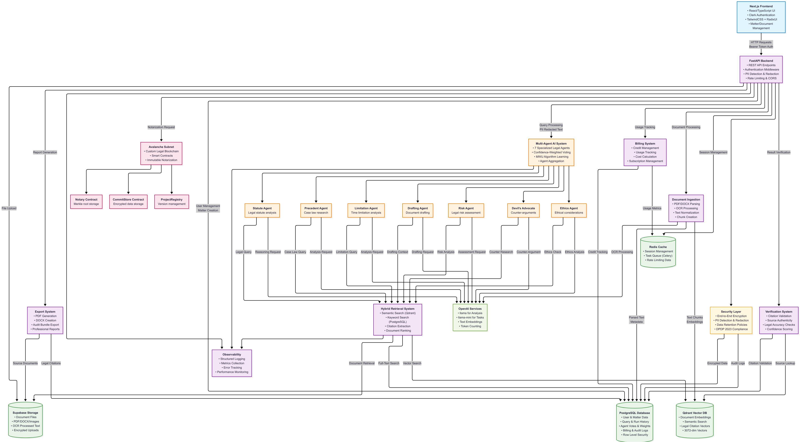

# GemmaFinOS

<div align="center">
  

  ### AI Financial Compliance & Risk Triage Platform
  *Purpose-built for Indian financial institutions*

  
  
  
  
  
  
</div>

---

## What is GemmaFinOS?

GemmaFinOS is a GenAI-powered financial compliance platform that runs a **DAO of Agents** — a panel of specialized AI agents that work in parallel, vote on findings, and produce a single auditable compliance report. Every report is cryptographically notarized on a custom **GemmaChain subnet** so the output is tamper-proof and audit-ready.

Built for Indian regulatory frameworks: **PMLA 2002, FEMA 1999, RBI KYC Master Directions, SEBI, IBC 2016**.

---

## Architecture

<div align="center">
  
</div>

```
User → Next.js Frontend → FastAPI Backend → DAO of Agents (parallel)
                                          ↓
                              Aggregator (MWU voting)
                                          ↓
                         Compliance Report + GemmaChain Notarization
```

---

## DAO of Agents

Five financial compliance agents run in parallel via `asyncio.gather`, each scoring a different risk dimension. An aggregator applies **Multiplicative Weight Updates (MWU)** to produce a confidence-weighted final report.

| Agent | Role |
|---|---|
| **TransactionAgent** | AML/CFT anomaly detection, structuring & round-trip patterns |
| **OnboardingAgent** | KYC/KYB gaps, PEP/sanctions screening, UBO verification |
| **RegulatoryAgent** | Framework mapping across PMLA, FEMA, RBI KYC, SEBI, IBC |
| **FinancialRiskAgent** | Credit, market, liquidity & operational risk scoring |
| **ReportAgent** | Synthesises all agent findings into a compliance-ready report |
| **Aggregator** | MWU-weighted voting, confidence scoring, STR/EDD auto-flagging |

Plus the original **legal research agents** (Statute, Precedent, Limitation, Risk, Devil's Advocate, Ethics, Drafting) for matter-level legal analysis.

---

## Key Features

**Compliance Triage**
- `POST /v1/compliance/triage` — parallel agent execution, returns domain risk scorecard
- STR (Suspicious Transaction Report) and EDD (Enhanced Due Diligence) auto-flagging
- `/compliance/history` — session-scoped run history with full report replay

**Financial Operations**
- Invoice processing, vendor management, approval workflows
- Cash flow analysis, penalty simulator, transaction monitoring
- SAP OData, Microsoft Graph (Outlook/Excel/SharePoint), and local DB connectors via Composio

**Legal Research (DAO)**
- Hybrid search: Qdrant semantic + PostgreSQL full-text (Indian Kanoon integration)
- Citation extraction and verification
- Matter workspace with document upload, chunking, and embedding pipeline

**Blockchain Notarization (GemmaChain)**
- Every compliance run generates a Merkle tree → root hash published on-chain
- `Notary.sol` — immutable run notarization
- `CommitStore.sol` — AES-GCM encrypted evidence storage
- `ProjectRegistry.sol` — version registry
- Chain ID: 43210 | Block time: 1s | Gas-free for end users

**Security & Privacy**
- AES-256 envelope encryption for all sensitive data
- Automatic PII detection and redaction (DPDP 2026 compliant)
- Crypto-shredding for right-to-erasure
- Row-level security, JWT auth via Clerk, rate limiting

---

## Tech Stack

| Layer | Technology |
|---|---|
| Frontend | Next.js 15, TypeScript, TailwindCSS, Radix UI, Clerk Auth |
| Backend | FastAPI, Python 3.12, SQLAlchemy 2.0 async, Celery |
| AI | Gemma 3-27b (Google AI Studio / OpenRouter), OpenAI fallback |
| Vector DB | Qdrant (semantic search) |
| Database | PostgreSQL 15 (NeonDB), Redis |
| Storage | Supabase Storage |
| Blockchain | GemmaChain Subnet, Solidity 0.8.20, Hardhat |
| Infra | Docker Compose, Alembic migrations |

---

## Quick Start

### Prerequisites
- Python 3.11+, Node.js 18+, Docker

### 1. Clone & configure
```bash
git clone https://github.com/JHA-geek-AYUSH/MSRIT.git -b v2
cd MSRIT

cp backend/env_example backend/.env
cp frontend/env.example frontend/.env.local
# Fill in your API keys — see env_example for all variables
```

### 2. Start infrastructure
```bash
cd infra && docker-compose up -d && cd ..
# Starts PostgreSQL, Redis, Qdrant
```

### 3. Backend
```bash
cd backend
python -m venv venv && venv\Scripts\activate   # Windows
pip install -r requirements.txt
alembic upgrade head
uvicorn app.main:app --reload --port 8000
```
API docs → http://localhost:8000/docs

### 4. Frontend
```bash
cd frontend
npm install && npm run dev
```
App → http://localhost:3000

### Gemma setup (Track 2)
Add to `backend/.env`:
```env
USE_GEMMA=true
GEMMA_API_KEY=<your_google_ai_studio_key>
GEMMA_MODEL=gemma-3-27b-it
GEMMA_BASE_URL=https://generativelanguage.googleapis.com/v1beta/openai/
```
Set `USE_GEMMA=false` to fall back to OpenAI.

---

## Project Structure

```
GemmaFinOS/
├── backend/
│   ├── app/
│   │   ├── agents/          # DAO agents (transaction, onboarding, regulatory, ...)
│   │   ├── api/v1/          # FastAPI route handlers
│   │   ├── core/            # Config, encryption, PII, security, Gemma client
│   │   ├── db/              # Models, CRUD, Alembic migrations
│   │   ├── notary/          # Merkle tree + GemmaChain web3 client
│   │   ├── retrieval/       # Qdrant, FTS, Indian Kanoon, chunking
│   │   ├── connectors/      # SAP, MS Graph, Composio, local DB
│   │   └── ml/              # Anomaly scorer, risk model, compliance scorer
│   └── requirements.txt
├── frontend/
│   ├── app/
│   │   ├── compliance/      # Triage, history, audit, transactions, vendors, ...
│   │   ├── matters/         # Legal matter workspace
│   │   ├── dashboard/
│   │   └── chat/
│   └── components/
├── subnet-contracts/        # Notary.sol, CommitStore.sol, ProjectRegistry.sol
└── infra/                   # docker-compose.yml
```

---

## Compliance Frameworks Covered

- **PMLA 2002** — Prevention of Money Laundering Act
- **FEMA 1999** — Foreign Exchange Management Act
- **RBI KYC Master Directions** — Know Your Customer norms
- **SEBI Regulations** — Securities market compliance
- **IBC 2016** — Insolvency and Bankruptcy Code
- **DPDP Act 2026** — Digital Personal Data Protection

---

## Roadmap

- [x] DAO of Agents with MWU voting
- [x] GemmaChain subnet notarization
- [x] Financial compliance triage (`/compliance`)
- [x] Legal research with hybrid search
- [x] SAP / MS Graph / Composio connectors
- [x] PII redaction + crypto-shredding
- [ ] Hindi & regional language support
- [ ] Mobile app (React Native)
- [ ] Enterprise SSO (SAML/LDAP)
- [ ] Cross-chain blockchain interop

---

<div align="center">
  <strong>Powered by GemmaChain · Built for Indian Financial Institutions · Open Source</strong>
</div>
